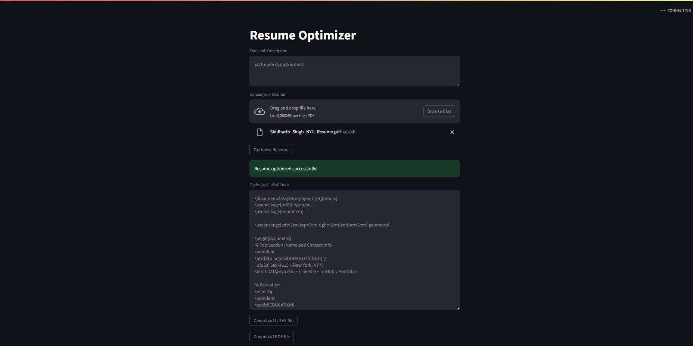

# Resume Maestro

This project is a Resume Optimizer application that uses OpenAI's GPT-4 model to optimize resumes based on provided job descriptions. It takes a resume PDF and a job description, optimizes the resume, and generates a LaTeX and PDF version of the optimized resume.

## Features

- Extract text from PDF resumes using PyMuPDF (fitz)
- Optimize resume content using OpenAI's GPT-4 model
- Generate LaTeX and PDF versions of the optimized resume
- Download the optimized LaTeX and PDF files

## Requirements

- Python 3.8+
- Streamlit
- FastAPI
- PyMuPDF
- OpenAI API
- Requests
- MiKTeX (for LaTeX processing)
- Docker (for Weaviate)

## Installation

1. Clone the repository:
    ```bash
    git clone https://github.com/your-username/your-repository-name.git
    cd your-repository-name
    ```

2. Create a virtual environment:
    ```bash
    python -m venv env
    ```

3. Activate the virtual environment:
    - On Windows:
        ```bash
        .\env\Scripts\activate
        ```
    - On macOS and Linux:
        ```bash
        source env/bin/activate
        ```

4. Install the required packages:
    ```bash
    pip install -r requirements.txt
    ```

5. Install MiKTeX for LaTeX processing. Follow the installation instructions on the [MiKTeX website](https://miktex.org/download).

## Usage

### Running the Backend

1. Navigate to the backend directory:
    ```bash
    cd backend
    ```

2. Run the FastAPI server:
    ```bash
    uvicorn app:app --reload
    ```

### Running the Frontend

1. Open a new terminal and navigate to the frontend directory:
    ```bash
    cd frontend
    ```

2. Run the Streamlit application:
    ```bash
    streamlit run app.py
    ```

3. Open your web browser and go to `http://localhost:8501`.

### Running Weaviate with Docker

1. Pull and run the Weaviate Docker container:
    ```bash
    docker run -d -p 8080:8080 semitechnologies/weaviate:latest
    ```

### Optimizing a Resume

1. Enter the job description in the provided text area.
2. Upload the resume PDF file.
3. Click the "Optimize Resume" button.
4. Download the optimized LaTeX and PDF files.

### Frontend Ui


#### If you do not like the generated resume then again click Optimize Resume

## License

This project is licensed under the MIT License. See the [LICENSE](LICENSE) file for details.

## Contributions
While this is a personal project focused on my own learning and development, any constructive feedback, suggestions, or contributions to the existing solutions are always welcome. If you'd like to contribute, please feel free to submit a pull request.

## Contact
For any inquiries or collaborations, feel free to reach out to me via sms10221@nyu.edu

## Acknowledgements

- [OpenAI](https://openai.com/) for the GPT-4 model
- [Streamlit](https://streamlit.io/) for the web application framework
- [FastAPI](https://fastapi.tiangolo.com/) for the backend framework
- [PyMuPDF](https://pymupdf.readthedocs.io/) for PDF processing
- [MiKTeX](https://miktex.org/) for LaTeX processing
- [Weaviate](https://www.semi.technology/developers/weaviate/current/) for vector search
